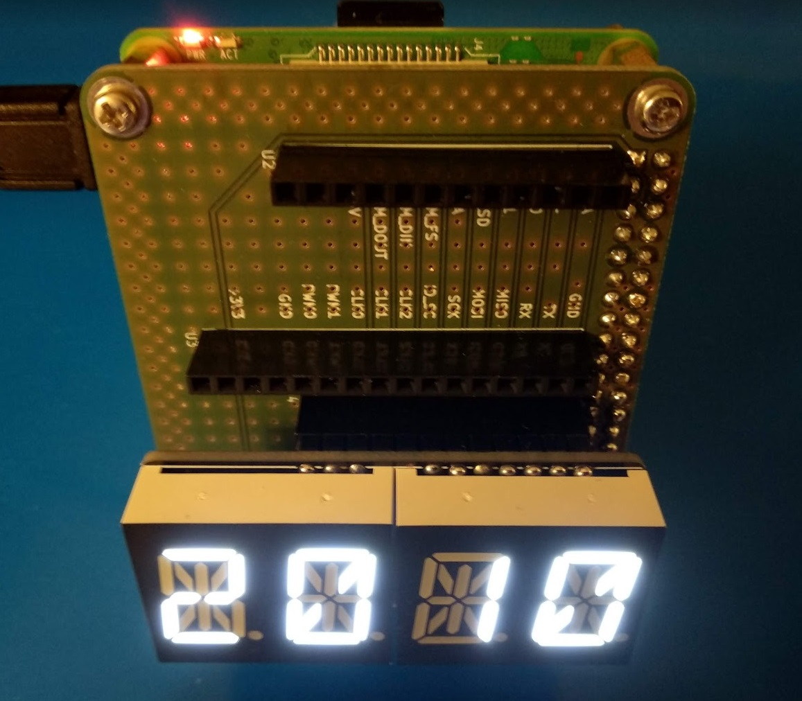

= Clock: 4-Digit 14-Segment Display

:toc:

### Bill of Materials
* https://www.raspberrypi.org/[Raspberry Pi]
* https://github.com/soerensofke/Pi2FeatherAdapter[Pi-to-Feather Adapter]
* https://learn.adafruit.com/14-segment-alpha-numeric-led-featherwing[4-Digit 14-Segment Display]

### Illustration

### Software Installation Instructions

##### 1. Enable I2C on RaspberryPi
Start RaspberryPi configuration app using the following command:
[source,bash]
----
sudo raspi-config
----
Select: (5) Interfacing Options -> (P5) I2C -> <Yes>

##### 2. Test I2C on RaspberryPi utilizing "Device Discovery"
Connect the display utilizing this Pi-to-Feather adapter. Perform a device discovery using the following command:
[source,bash]
----
sudo i2cdetect -y 1
----
By default, the display responds with address 0x70.

##### 3. Prepare Software Installation
While Python 3 is installed by default, you need to install the Python Package Manager pip manually.
[source,bash]
----
sudo apt-get update
sudo apt-get upgrade
sudo apt-get install python3-pip
----

##### 4. Install https://github.com/adafruit/Adafruit_Blinka[CircuitPython] and https://learn.adafruit.com/adafruit-7-segment-led-featherwings/[display library]

Install the required libraries to use this DisplayClock application.

[source,bash]
----
sudo pip3 install Adafruit-Blinka
sudo pip3 install adafruit-circuitpython-ht16k33
sudo pip3 install pytz
----

##### Download
Download the DisplayClock Python software using the following command
[source,bash]
----
wget https://raw.githubusercontent.com/soerensofke/Pi2FeatherAdapter/master/softwareExamples/i2c/displayClock.py
----

##### Run
To run the DisplayClock Python software in backgroud, start it using the following command
[source,bash]
----
nohup python3 displayClock.py &
----

### DisplayClock Python Listing
[source,python]
----
include::displayClock.py[]
----